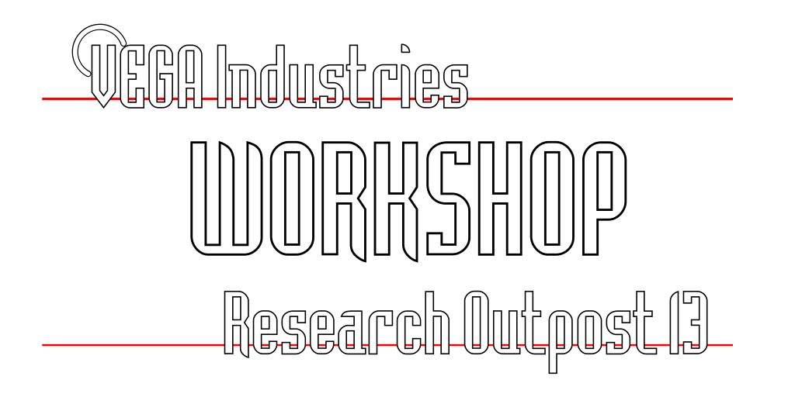

Vega texture set for Unvanquished
=================================

About
-----

[_Vega Industries: Research Outpost 13_](https://github.com/UnvanquishedAssets/map-vega_src.dpkdir) is a game level featuring a futuristic research station for the [Unvanquished](https://unvanquished.net) game project. This is the texture set originally designed for this map.

This texture set is a work in progress by Stijn “Ingar” Buys for the [Unvanquished](https://unvanquished.net) game project.

This texture set is meant to be used with a level editor like [NetRadiant](https://netradiant.gitlab.io/).

Visit the [Unvanquished website](https://unvanquished.net/) for more information about the game itself.

Legal
-----

This texture set is available under the terms and conditions of either the [Creative Commons Attribution-Share Alike 3.0 license](https://creativecommons.org/licenses/by-sa/3.0) or the [General Public License, version 2](https://www.gnu.org/licenses/old-licenses/gpl-2.0.en.html).

Consult the [`about/tex-vega.txt`](about/tex-vega.txt) file for a full overview of the contributors of this project.

Credits
-------

- [Stijn “Ingar” Buys](http://ingar.intranifty.net/)
- The [Unvanquished team](https://unvanquished.net/about/)
